# Frontend Documentation

## Table of Contents

1. [SearchBar](#searchbar)
2. [useMapsFormData](#usemapsformdata)
3. [Maps2](#maps2)
4. [EventForm](#eventform)
5. [LoginPage](#loginpage)
6. [RegisterForm](#registerform)
7. [userEvents](#userevents)
8. [friendsList](#friendslist)
9. [AuthContext](#authcontext)
10. [Navbar](#navbar)
11. [User Update (Komponent)](#user-update-komponent)
12. [UserProfilePage](#userprofilepage)
13. [EventInfoPage](#eventinfopage)
14. [Tabs Komponent](#tabs-komponent)

### SearchBar

I denna fil finns ett form som har en text input för att kunna söka på platser och två inputs för att kunna välja två olika stilar på kartan.

För att inte göra ett Api call vid varje bokstav som skrivs utan när ordet är klart och användaren trycker på submit så gjorde jag en ny useState som tar emot plats

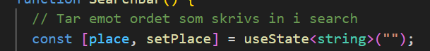

För att endast uppdatera denna när användaren klickar på knappen bredvid input så kopplade jag en funktion handleSubmit med en onClick.


För att kunna skriva in ett sökord och se uppdateringar på ordet man skriver in i text inputen finns en useState

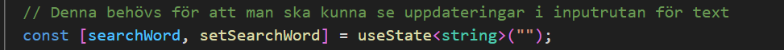

Inputen har en onchange som är kopllad till handlechange denna funktionen uppdaterar en useState som heter setSearchWord som sätter in varjekonstav som skrivs i textrutan.

Funktionen handleSubmit har en funktion som heter `event.preventDefault();` som förhindrar att sidan laddas om sedan uppdaterar den en annan useState som heter place med searchWord.

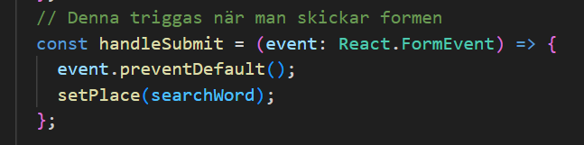

När place är satt kommer den att trigga useEffect där denna variabel finns som trigger som kommer att trigga funktionen `fetchData()` som finns i den som i sin tur kommer sätta in place i anropet och därmed hämta data i forma av json. Som till sist kommer att uppdatera useState LocationData med den hämtade jsonDatan.

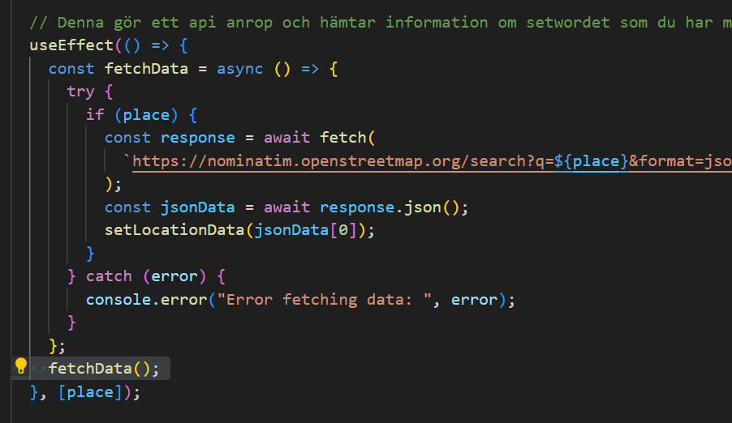

`updateUserLocation` variabel bundit funktionen för att kunna uppdatera store med värdena latitude och longitude som har hämtats från anropet. UseEffecten används för att trigga denna funktion och skicka dessa variabler till storen.

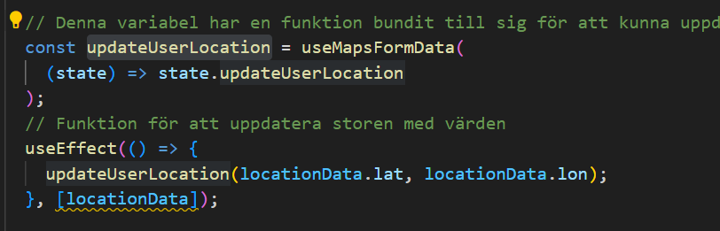

För att kunna byta mellan två plika kartor finns två radio inputs med två olika value som har onChange som är kopllat till `handleChangeRadio`

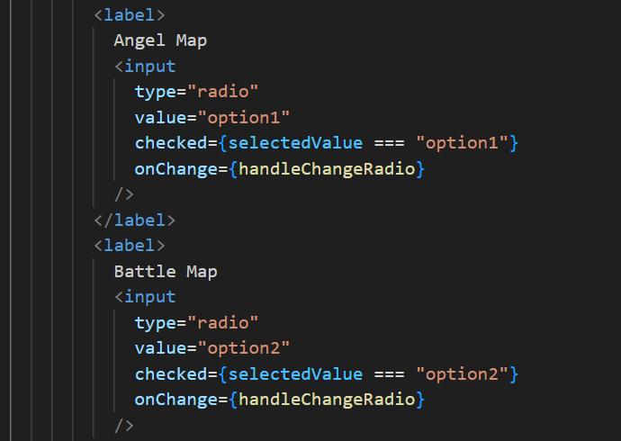

Denna funktion fungerar precis likadant som för sökordet och kommer i sin tur uppdatera en useState som heter SelectedValue
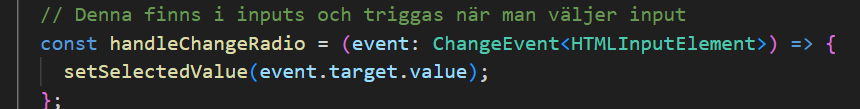

Denna usestate har default value på option1 så att kartan alltid visar de valet från början.

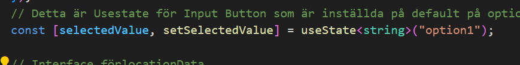

Variabeln updateOption är sedan kopplad till useMapsFormData funktionen som i sin tur triggar state.updateOption funktionen i storen. Denna variabel blir en funktion eller knuten till en funktion som sedan används i useEffekten för att sätta in och uppdatera selectedValue i storen.

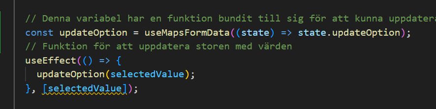

useMapsFormData

Detta är en store som satts upp för att kunna skicka variabler mellan olika komponenter. userLocation och option är vaiablerna som kommer bli uppdaterade med värden i storen. updateUserLocation är funktionen i storen som används för att uppdatera variablerna med de nya värdenna för lat och lon. updateOpten är funktionen i storen som används för att uppdatera variabeln option med nya värden. Denna stor behöv som nämt för att kunna dela lon och lat mellan searchbaren och map2 för att kunna söka på ett område och att kartan ska kunna visa det området.

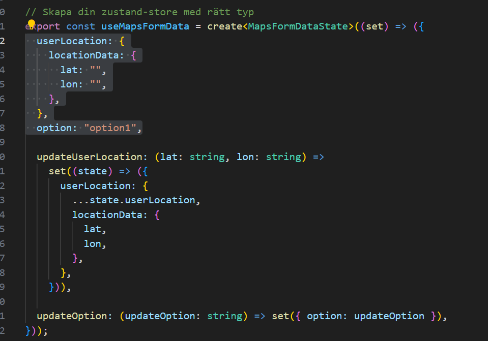

Interfacen som används i storen är till för att deffinera typerna av värden som finns i storen.

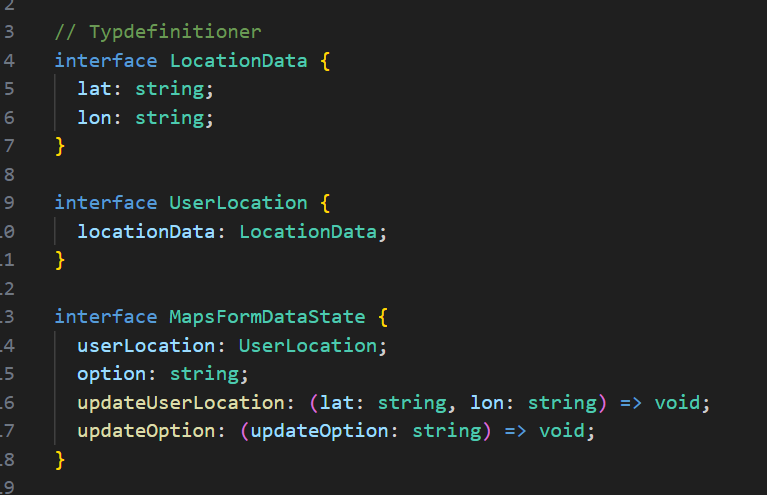

Maps2

När denna component skapas så körs denna useEffekt som triggar funktionen getUserLocation och sätter användarens värden i useState Latitude och Longitude användaren kommer också kunna se event som är skapade och markers på kartan. Detta för att denna komponent gör en fetch till databasen när den skapas och då går en loop igenom alla event som finns och lägger ut dom på kartan.

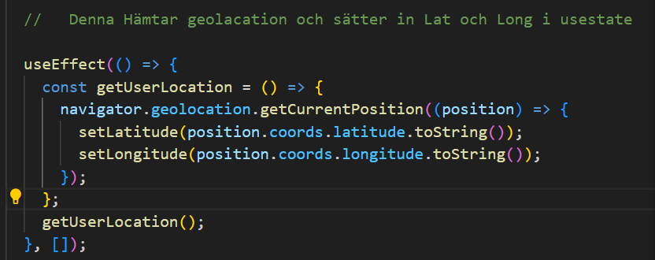

För att uppdatera med en ny plats som användare söker efter så tar vi in latitude och longitude från storen genom att hämta variablerna.

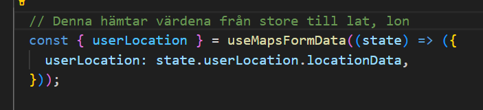

useEffekten har userLocation som dependensie så när den uppdateras med nya värden från storen så kommer denna att triggas och den kommer då att uppdatera useState Latitude och Longitude med nya värden.
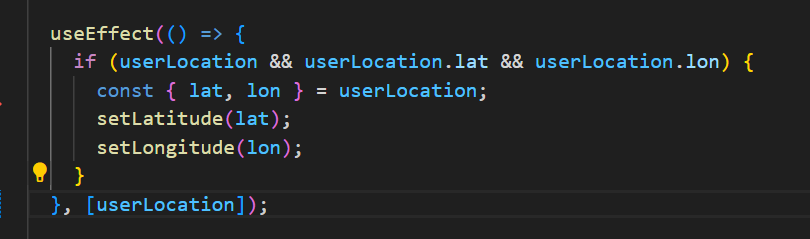

Option hämtas också från store och läggs in i variabeln option.

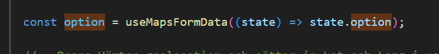

Variablerna från usestate för lon. lat kommer sedan uppdatera esuEffekten för kartan. Kartan har Latitude, Longitude och option som dependesie och detta betyder att när något av dessa värden ändras så kommer denna att uppdateras. Lat och lon skulle då sättas in för arr uppdatera kartan och denna vy och option finns i if för att se om värdet är option 1 eller 2 som då bestämmer vilken kart vy som kommer visas
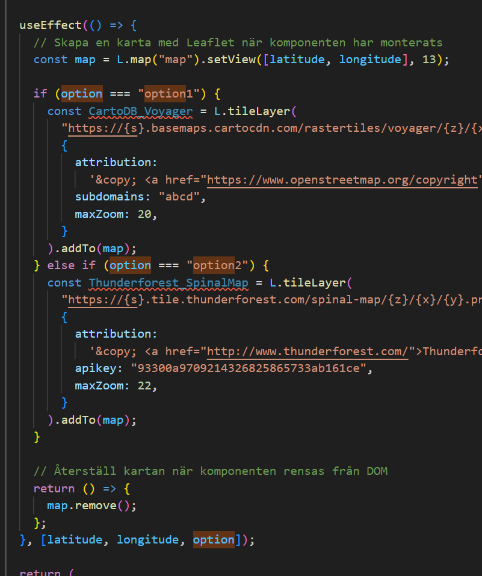

För att adda Marker när en användare lägger till ett nytt event så gjorde jag en useEffekt som triggas varjegång komponenten skapas denna useEffekt har en fetch i sig som gör en get request till databasen för att hämta alla event.

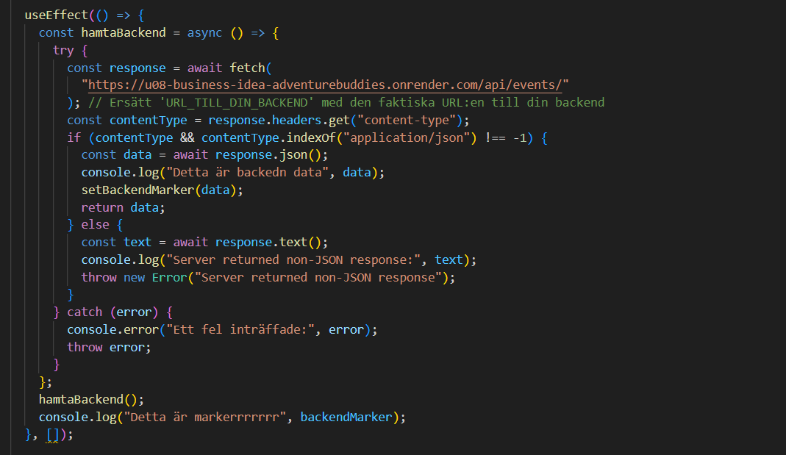

I hamtaBackend så har jag en setBackendMarker som uppdaterar detta useState med all data från backend. För att sedan få ut en marker på kartan för varje event som har skapats så gjorde jag sedan en forEach på backendMarker för att sätta ut en pin för varje destination jag lade även till `binPopup()` för att lägga till aktivitet vid varje pin.

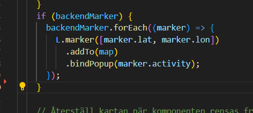

Föratt dölja API KEY i frontend så skapade jag en .env fil där jag satte in nyckeln och sedan hämtade jag nyckeln därifrån med hjälp av import för att sedan sätta in den i url:en.

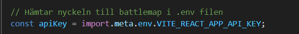

EventForm:

Detta form tar in data om event och skall skicka över lon, lat till maps för att kunna trigga en funktion som lägger till en marker på användarens event destination.

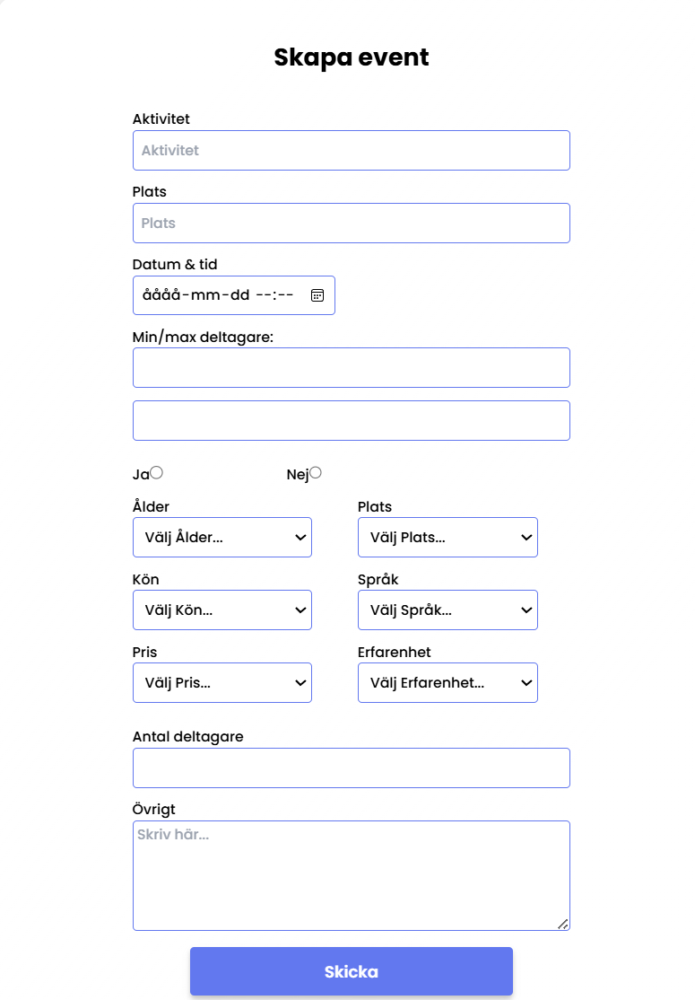

Till detta form hade jag först ett interface men upptäckte att man intebehöer ha ett interface om typeerna tolkas korrekt. Detta sätt att typbestämma utan att använda interface heter inlined state initialization med detta menas att typescript aoutomatiskt försöker bestämma typerna utifrån de initiala värdenna som sätts.

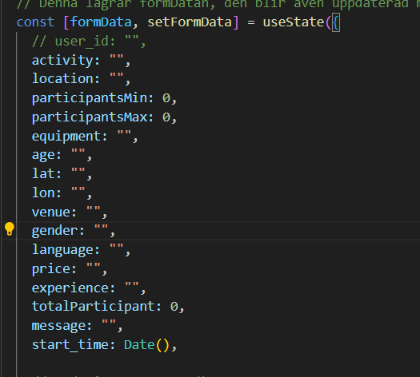

Jag upprättade sedan en fetch funktion som skulle kunna skicka ordet som skrivs in på plats till API:t för att kunna få kordinater. För att bara skicka ett API call var jag tvungen att göra yttliggare en useState som inte uppdateras på onchange utan på sumbit. setFormdata uppdateras på onchanger varjegång användaren gör någonting med formet. När användaren känner sig klar och trycker på submit så kommer onsubmit att köras och i den funktionen finns preventDefault() som hindrar så att inte sidan laddas om och setPlace() som kommer att hämta location från formData och sätta den i SetPlace. Efter data är satt så omdirrigeras användaren till en annan sida med hjälp av navigate().

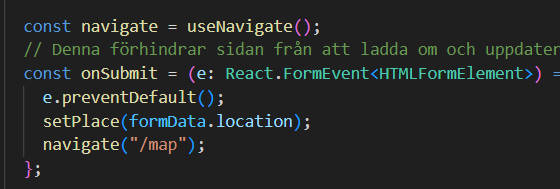

Min fetchData har jag satt i en useEffekt som har place som trigger och kommer när användare trycker på sumbit och place uppdateras att triggas och då göra ett api call.

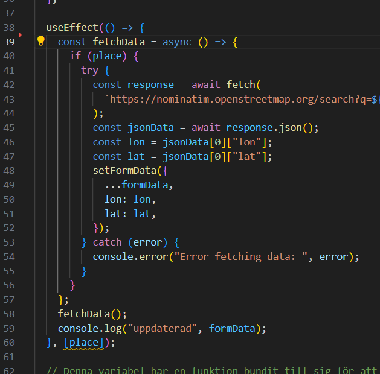

I denna useEffekt har jag seddan tagit jsondatan med lon, lat och satt in dessa i formData för att sammla all info på en och samma plats.

För att säkerställa att place är satt innan ett försök att skicka formet tillbackend görs så var jag tvungen att lägga till ett nytt usestate för att ha koll på när formet är redo för att skickas

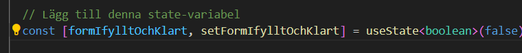

if sattsen som finns nedan kommer att köras om formIfylltOchKlart är false då kommer den sätta denna usestate till true och sätta fkordinaterna i setPlace()

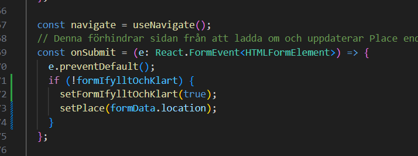

efter detta så kommer sendDataBackend att köras på grund av att formData.lat och formdata.lon finns i dependesi arrayen på useEffekten. i denna finns en navigate som kommer köras och finally kommer att ändra formIfylltOchKlart till false.

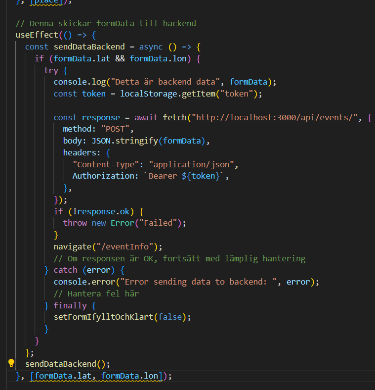

---

<u>LoginPage:</u>

Denna komponent hanterar inloggningen genom att samla användarens inmatning --> skicka den till en server --> och om inloggningen är lyckad, navigeras användaren till sin profil.

Detta uppnås via olika funktioner som hanterar olika tillstånd. Nedan kommer en övergriplig beskrivning av koden:

I koden importeras `useState` som är en React Hook för att hantera komponentes tillstånd. Biblioteket `React` används för att bygga användar gränssnitt.
`Link`, `useNavigate` och `useOutletContext` är funktioner från `react-router-dom` som hanterar navigation och kontext inom en router.

I interface `ContextType` beskrivs även vilken kontexttyp som finns för `onLogin` funktionen som tar in `email`, `userId` och `token`.

I funktionen `LoginForm` möter vi `checked` och `setChecked` som hanterar tillståndet för checkbox.

`navigate` navigerar till en annan sida.

`onLogin` är en funktion som är hämtar från kontexten att hantera inloggning.

`formData` och `setFormData` hanterar tillståndet för formulärdatan från användaren (email och lösenord).

I `LogoinForm` komponenten har vi även funktioner som
`handleInputChange` som uppdaterar tillståndet för `formData` när användaren skriver in email eller lösenord.
`handleChange` finns för att kunna uppdatera tillståndet i checkbox för att komma ihåg användaren i formuläret.

Funktionen `handleSubmit` hanterar formulärets inmatning genom att skicka inloggningsuppgifterna till servern via en POST-förfrågan och behandlar svaren för att logga in samt navigera användaren till sin profil.

I returen framgår komponentens UI, det vill säga User Interface, vilket är själva formuläret som användaren ser framför sig. Den är för oss utvecklare, kopplad till en databas som tar in informationen från användaren.

---

<u>RegisterForm: </u>

Som föregående formulär tar även denna in olika data från användaren för registrering.

I komponenten `RegisterPage` har vi även här en `formData` och `setFormData` som hanterar tillståndet för all data som innehåller användaren registreringsuppgifter.

Funktionerna som framgår här är bland annat `handleInputChange` (uppdaterar `formData` när använder ger oss ett värde i textfälten), `handleSelectChange` (uppdaterar `formData` när användaren väljer ett visst värde i vår dropdown-meny).

Funktionen som hanterar formurlärets insändning av data är `handleSubmit` som också skickar allt, likt `LoginForm`, uppgifterna till servern via POST-förfrågan och behandlar svaren för att indikera om registreringen lyckades eller inte.

I vår retur, som blir användarens UI, har vi ett formulär som tar in data som `namn`, `användarnamn`, `email`, `lösenord`, `födelsedatum`, `kön` och `telefonnummer`. Knappen till formuläret triggar igång funktionen `handleSubmit`.

När detta är klart har vi en fullt registrerad användare i vår databas som är redo att logga in och skapa sina egna event samt få tillgång till sin profilsida.

### userEvents

This is a component that manages the display of events related to the user. It fetches the events from our server in the backend and display in two tabs, `Upcoming Events`and `Mina Events`.

In this component we imported `React`, `useState`, and `useEffect` from the React library and we use it to build the user interface. Moreover, `Tab`, `Tabs` and `TabsProvider` are components imported from the tabs folder for handeling the tabbed interfaces.

Our `Event` interface describes the shape of event object and looks as follows:

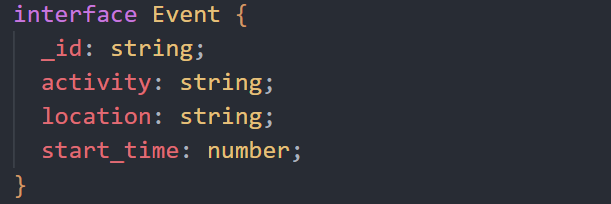

Next is our `UserEvents` function where we declare several state variables. The variables ar as following:

`
const [activeTabIndex, setActiveTabIndex] = useState(0);
  const [createdEvents, setCreatedEvents] = useState<Event[]>([]);
  const [upcomingEvents, setUpcomingEvents] = useState<Event[]>([]);
  const [attendingEvents, setAttendingEvents] = useState<Event[]>([]);
`
The first variable handels the state of whichever tab is active. The following three handels the state of different types of events.

Next we declare the `useEffect` hook and we use it to fetch events when the component is mounted or when the active tab changes. Inside the useEffect hook we have a `fetchEvents` function that is used to retrive the user's event from the server (our backend deployed in render).

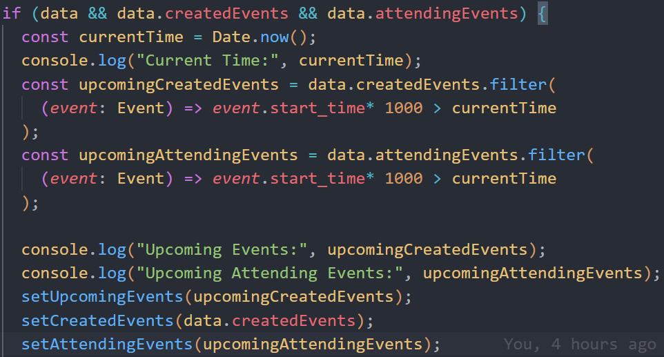

It checks for token in local storage and get the user ID from it and it handels as the response we get from our server and filter the events which are either attending or created in the response into upcoming and created events.

The `TabsProvider` component imported from tabs folder wraps the `Tabs` which contains the two `Tab` components we are using. We can add tabs as required.

The component is then imported and rendered in the UserProfile Page.

---

### friendsList

Here in this component we manage and display the list of friends a user has, incoming friend requests, search friends functionalty and send friendship request option. The fetch is made like the user events from the server side (our backend) and the tabs used for display are `Search Users`, `Friend Requests` and `Friends`.

The imports are similar to the user event component. And our User interface that we declared here is describing the shape of user related data from our userinterface in our backend as well as friend interface.

```
interface User {
  _id: string;
  name: string;
  email: string;
  status: string;
  requester: {
    _id: string;
    userName: string;
  };
  recipient: {
    _id: string;
    name: string;
  };
}
```

We declared next our FriendList function and it has several state variables. The variabels are as follows:

```
  const [activeTabIndex, setActiveTabIndex] = useState(0);
  const [friends, setFriends] = useState<User[]>([]);
  const [searchResults, setSearchResults] = useState<User[]>([]);
  const [incomingRequests, setIncomingRequests] = useState<User[]>([]);
  const [searchQuery, setSearchQuery] = useState("");
  const [modalMessage, setModalMessage] = useState<string | null>(null);
```

By now we know what the activeTabIndex states handels, But the other five variables handels different states and user related data. One of the functions we have declared under our `fetchFriends` function is `handleFriendRequest` function. This function is a very crucial one as it is responsible for handling several actions related to the friend requests. Different requests like sending, accepting, rejecting and removing friends.

The function takes in two parameters, `friendId` and `action`. How the function works is that it checks if the token exist and then declares two variabels `url` and `method` which is used for fetch request. We have used a Switch statement to determine the appropraite url and method based on the action.

If the `action` is "send", "accept" or "reject" the `method` used is "POST". And if the `action` is "remove" the `method` used is "Delete". After a sucessful fetch request the function updates the state and fetches the updates list. When `action` is "accept" or "reject", it fetches the incoming request. If it is "remove" it fetches into friends and if it was "send" it performs a search.

Next the function sets a message to be displayed to the user based on the action. and the message is stored in the `modalMessage` state variable.

```
const token = localStorage.getItem("token");
  const userId = localStorage.getItem("id");
  console.log(activeTabIndex); //låt stå annars ERROOOOORR
  
  const fetchFriends = async () => {
    try {
      if (!userId || !token) {
        throw new Error("User ID or token not found in local storage");
      }
      const response = await fetch(
        `https://u08-business-idea-adventurebuddies.onrender.com/api/users/${userId}/friends`,
        {
          method: "GET",
          headers: {
            "Content-Type": "application/json",
            Authorization: `Bearer ${token}`,
          },
        }
      );
      if (!response.ok) {
        throw new Error("Network response was not ok");
      }

      const data = await response.json();
      setFriends(data.friends || []);
    } catch (error) {
      console.error("Error fetching friends:", error);
    }
  };

  const fetchIncomingRequests = async () => {
    try {
      if (!token) {
        throw new Error("Token not found in local storage");
      }

      const incomingResponse = await fetch(
        `https://u08-business-idea-adventurebuddies.onrender.com/api/friends/received`,
        {
          method: "GET",
          headers: {
            "Content-Type": "application/json",
            Authorization: `Bearer ${token}`,
          },
        }
      );
      if (!incomingResponse.ok) {
        throw new Error("Network response was not ok");
      }

      const incomingData = await incomingResponse.json();
      setIncomingRequests(incomingData.requests || []);
    } catch (error) {
      console.error("Error fetching friends:", error);
    }
  };

  const handleSearch = async () => {
    try {
      if (!token) {
        throw new Error("Token not found in local storage");
      }

      const response = await fetch(
        `https://u08-business-idea-adventurebuddies.onrender.com/api/users/search?search=${searchQuery}`,
        {
          method: "GET",
          headers: {
            Authorization: `Bearer ${token}`,
          },
        }
      );

      if (!response.ok) {
        throw new Error("Network response was not ok");
      }
      const data = await response.json();

      const filteredResults = data.filter((user: User) => user._id !== userId);

      setSearchResults(filteredResults);
    } catch (error) {
      if (error === "Friend request already sent") {
        ("You have already sent a friend request to this user");
      } else {
        console.error("Error searching users:", error);
      }
    }
  };

  const handleFriendRequest = async (friendId: string, action: string) => {
    try {
      if (!token) {
        throw new Error("Token not found in local storage");
      }

      let url = "";
      let method = "POST";

      switch (action) {
        case "send":
          url = `https://u08-business-idea-adventurebuddies.onrender.com/api/friends/request/${friendId}`;
          break;
        case "accept":
          url = `https://u08-business-idea-adventurebuddies.onrender.com/api/friends/accept/${friendId}`;
          break;
        case "reject":
          url = `https://u08-business-idea-adventurebuddies.onrender.com/api/friends/reject/${friendId}`;
          break;
        case "remove":
          url = `https://u08-business-idea-adventurebuddies.onrender.com/api/friends/${friendId}`;
          method = "DELETE";
          break;
        default:
          throw new Error("Unknown action");
      }

      const response = await fetch(url, {
        method,
        headers: {
          "Content-Type": "application/json",
          Authorization: `Bearer ${token}`,
        },
      });

      if (!response.ok) {
        const errorData = await response.json();
        console.error("Server response error:", errorData);
        throw new Error("Network response was not ok");
      }

      if (action === "accept" || action === "reject") {
        fetchIncomingRequests();
      } else if (action === "remove") {
        fetchFriends();
      } else if (action === "send") {
        handleSearch();
      }

      fetchFriends();
      fetchIncomingRequests();
      handleSearch();

      let message = "";
      switch (action) {
        case "send":
          message = "Friend request sent.";
          break;
        case "accept":
          message = "Friend request accepted.";
          break;
        case "reject":
          message = "Friend request rejected.";
          break;
        case "remove":
          message = "Friend removed.";
          break;
        default:
          break;
      }
      setModalMessage(message);
    } catch (error) {
      console.error(`Error handling friend request:`, error);
    }
  };

  useEffect(() => {
    fetchFriends();
    fetchIncomingRequests();
  }, []);

  const closeModal = () => {
    setModalMessage(null);
  };
```

Next step was declaring the `useEffect` hook. This hook is used to fetch the friends and incoming requests when the component is mounted. Inside the useEffect hook, we have `fetchFriends` and `fetchIncomingRequest` functions that are used to retrive friends and incoming requests from our backend. There are checks for token in our loaclStorage and we get the userId and info related to it.

Similarly to the userEvents components the `TabsProvider` components wraps the `Tabs` and `Tab` and we import the `friendList` componenet in the userProfile page.

---

### AuthContext

AuthContext är en React-kontext som hanterar autentiseringslogiken för en applikation. 
Här är en kort förklaring av vad den gör:

1. Kontextdefinition: AuthContext skapas med createContext och används för att lagra autentiseringsstatus och relaterade data som e-post, användar-ID och token.

2. `AuthProvider`: Detta är en komponent som förser sina underkomponenter med autentiseringsdata och funktioner för att logga in och logga ut.
    * Statehantering: `useState` används för att hantera autentiseringstillstånd (isAuthenticated), e-post (email), användar-ID (userId) och token (token).
    * Lokal lagring: Vid första renderingen hämtar `useEffect` eventuellt sparad autentiseringsdata från `localStorage` och uppdaterar state om användaren är inloggad.
    * Login-funktion: Uppdaterar state och `localStorage` med användarens e-post, ID och token när användaren loggar in.
    * Logout-funktion: Rensar state och `localStorage` när användaren loggar ut.
3. `useAuth`: En anpassad `hook` som gör det enklare för komponenter att använda autentiseringskontexten. Den kastar ett fel om den används utanför `AuthProvider`.

Sammanfattningsvis hanterar AuthContext autentiseringsstatus och användaruppgifter samt erbjuder inloggnings- och utloggningsfunktionalitet, vilket gör att resten av applikationen kan få tillgång till denna information på ett enkelt och konsekvent sätt.

**Vart använder vi AuthContext då?**

* Main.tsx:
    * Med hjälp av AuthContext har vi omslutit vår RouterProvider med `AuthProvider` och lagt till ProtectedRouteProps för att säkerställa att användare måste vara inloggade för att kunna se alla sidor.


* App.tsx
    * I App.tsx tar vi hand om login och logout och om användarens autentiserings status

* LoginPage.tsx
    * Här lägger vi till användarens email, id och token när vi loggar in, som sparas och delas till de sidor där man behöver vara inloggad (sköts i App.tsx som vidare är kopplat till AuthContext.tsx). 

* Navbar.tsx
    * Vi hämtar AuthContext här för att kolla om man är inloggade eller inte, är vi inloggade visas vårat namn istället för logga in samt att vi får en dropdown meny med olika länkar i. Vi hanterar även logga ut (logout) här.

* EventListItem.tsx
    * här använder vi oss av isAuthenticated för att kunna visa en del data för personer som inte är inloggade, och mer detaljer om du är inloggad

---

### Navbar

I navbaren har vi länkar (*Link*) till respective sida, stylingen ser olika ut beroende om du är på mobil eller desktop. Login knappen blir en dropdown när du väl loggat in, och den bytter då till ditt användarnamn (username). I dropdown menyn använder jag mig av *EventListener* för mustryck för att den ska stängas när du tryckt på en länk eller trycker utanför menyn. Har även en *useEffect* för att den ska stängas när du har loggat ut, så när du loggar in nästa gång så är den stängd. 

User iconen i mobil vyn tar dig antingen till login eller userProfile beroende på om du är inloggad eller inte. 
Man loggar sedan ut via user update form.

Mobil:


Desktop:


---

### User Update (Komponent)

Vi använder oss av en *UserUpdateProps*, där vi använder oss utav `userData` som innehåller informationen vi vill uppdatera och `setUserData` funktion för att uppdatera datan i parent-komponenten (i detta fall UserProfilePage).

`useEffect` och `useState` använder vi oss av för att hantera komponentens tillstånd och livscykel.

Till exempel använder vi oss av `useEffect` för att uppdatera `formData` när `userData` ändras.

`handleInputChange` uppdaterar `formData` baserat på var användaren matar in i input fälten, här inkluderar vi även filuppladning med hjälp av `multer` i våran backend. Så att filerna kan sparas i databasen (Mongodb).


`handleUpdate` skickar en PUT-förfrågan till våran backend för att uppdatera användarens data.
`handldeRemoveAccount` skickar en DELETE-förfrågan för att radera en användares konto. I `handldeRemoveAccount` använder vi oss av en `window.confirm` för att få upp en ruta för att dubbelkolla om användaren verkligen vill radera sitt konto. 

Komponenterna `Button` och `Input` använder vi oss av för användargränssnittets knappar och inmatningsfält. Så att alla knappar och fält ser lika dana ut på alla sidor.

`useNavigate` från `react-router-dom` använder vi oss av för att kunna navigeringa mellan olika sidor.

***När du är i mobil vyn så loggar du ut via user update formuläret*** 

---

### UserProfilePage

På den här sidan hämtar och visar vi användarens profilinformation. 

Vi använder oss av `userData` för att kunna visa och uppdatera användarens information.

Även här använder vi oss av `useEffect` och `useState` för att hantera komponentens tillstånd och livscykel.

`useEffect` körs när komponenten mountas (renderas för första gången). Den innehåller en asynkron funktion `fetchUserData` som gör följande:
1. Hämtar användarens-ID och token från `localStorage`.
2. Skickar en GET-förfrågan till API för att hämta användardata.
3. Om förfrågan lyckas, uppdaterar `userData` med den hämtade datan.
4. Om förfrågan misslyckas, loggar det ett felmeddelande.


I `returnen` hämtar vi även data från komponenterna **UserUpdate**, **UserEvents** och **FriendsList**.

---

### EventInfoPage

EventInfoPage.tsx representerar en sida i applikationen som visar detaljerad information om ett specifikt event. Denna sida hanterar interaktioner och visar informationen på ett strukturerat sätt.

Komponenten använder React för att bygga sidan och hanterar state och livscykel med React Hooks såsom useEffect och useState. Den importerar också återanvändbara komponenter och verktyg för att förbättra användarupplevelsen.

Sammanfattningsvis representerar EventInfoPage.tsx en sida i applikationen som fokuserar på att visa och hantera detaljer kring ett specifikt event. Den hanterar både datainhämtning och användarinteraktioner för att ge en fullständig och användbar upplevelse för användarna.

<a name="API-URL"></a>

#### API-URL

```typescript {
// hämta eventId state och value från EventListItem.
const location = useLocation();
let EVENT_ID = location.state.eventId;
```

Denna del av koden använder useLocation()-hooken från React Router för att hämta platsens tillstånd. I detta fall använder den den del av tillståndet som skickades från EventListItem.tsx via navigeringen. EVENT_ID tilldelas värdet av eventId från platsens tillstånd.

```typescript {
const handleEventItemClick = (eventId: string) => {
  console.log(eventId);
  navigate("/eventInfo", {
    state: {
      eventId: eventId,
    },
  });
};
```

Från EventListItem.tsx som skickar statet eventId

```typescript {
const API_URL = `https://u08-business-idea-adventurebuddies.onrender.com/api/events/${EVENT_ID}`;
```

Här skapas en URL för att hämta detaljer om ett specifikt event från en extern API. EVENT_ID används för att specificera vilket event som ska hämtas.

```typescript {
const API_URL_ATTEND = `https://u08-business-idea-adventurebuddies.onrender.com/api/events/${userId}/attend/${EVENT_ID}`;
const API_URL_UNATTEND = `https://u08-business-idea-adventurebuddies.onrender.com/api/events/${userId}/unattend/${EVENT_ID}`;
```

Dessa variabler skapar URL
för att registrera eller avregistrera användaren från det specifika eventet. userId används för att identifiera användaren, medan EVENT_ID specificerar vilket event som är aktuellt.

<br>
Så sammanfattningsvis, koden hämtar eventId från EventListItem.tsx, använder detta eventId för att skapa olika URL
för att hämta eventinformation och hantera användarens deltagande i eventet.

#### Attend or not Attend

Dessa två funktionerna fungerar väldigt likt varandra då båda använder sig av en POST-förfrågan, fast mot olika
URL:Er [Läs URL STRUKTUR](#API-URL) och att en useState sätts till true eller false.

```typescript {
const [isAttending, setIsAttending] = useState(false);
```

```typescript {
const handleAttendEvent = async () => {
  // Hantera om användaren är autentiserad
  // Skicka en POST-förfrågan för att registrera användaren till eventet
  // Uppdaterar isAttending-tillståndsvariabeln till true om förfrågan lyckas.
};

const handleUnAttendEvent = async () => {
  // Hantera om användaren är autentiserad
  // Skicka en POST-förfrågan för att avregistrera användaren från eventet
  //Uppdaterar isAttending-tillståndsvariabeln till false om förfrågan lyckas.
};
```

### Tabs Komponent

#### Tabs.tsx

`Tabs.tsx` är huvudkomponenten för flikfunktionaliteten. Den använder `useTabs`-hooken från `TabsContext.tsx` för att få tillgång till den aktiva fliken. Den renderar alla barnkomponenter och klonar varje barn med ett extra `index`-attribut. Den renderar också innehållet för den aktiva fliken.

#### TabsContext.tsx

`TabsContext.tsx` definierar och exporterar `TabsContext`, `useTabs`-kroken och `TabsProvider`-komponenten. `TabsContext` är en React Context som håller den aktiva fliken och en funktion för att ändra den. `useTabs` är en krok som returnerar värdet av `TabsContext`. `TabsProvider` är en komponent som håller state för den aktiva fliken och tillhandahåller den till dess barn via `TabsContext`.

#### Tab.tsx

`Tab.tsx` är en komponent som representerar en enskild flik. Den använder `useTabs`-hooken för att få tillgång till den aktiva fliken och funktionen för att ändra den. När en flik klickas på, sätts den som den aktiva fliken.

#### Tabs.css

`Tabs.css` innehåller alla stilar som behövs för flikarna. Det definierar stilar för flikarna, den aktiva fliken och flikinnehållet.
