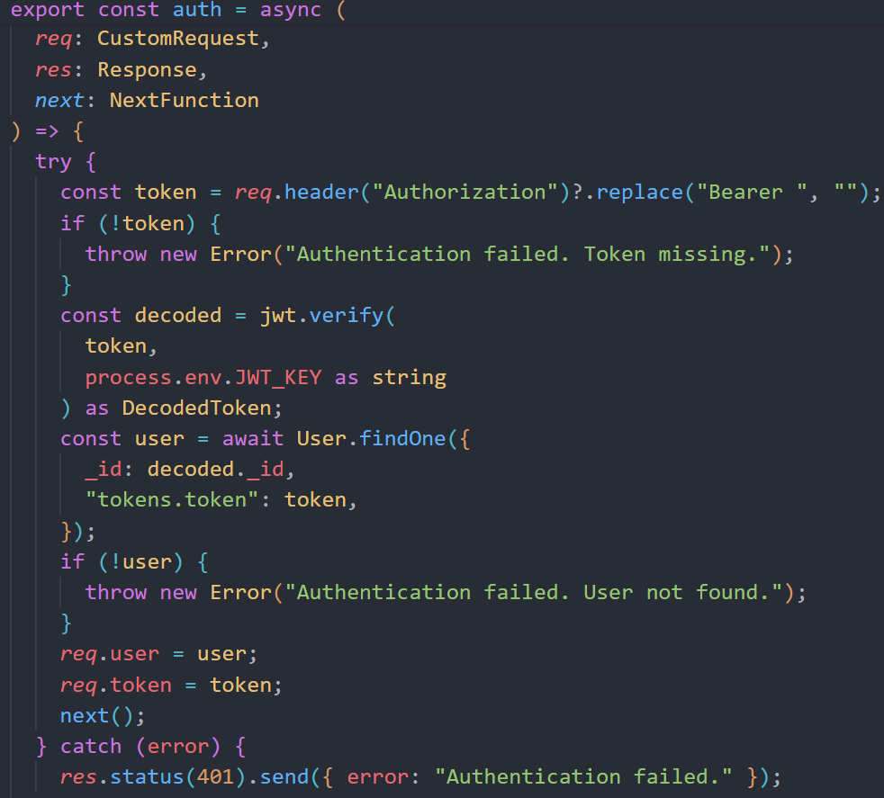
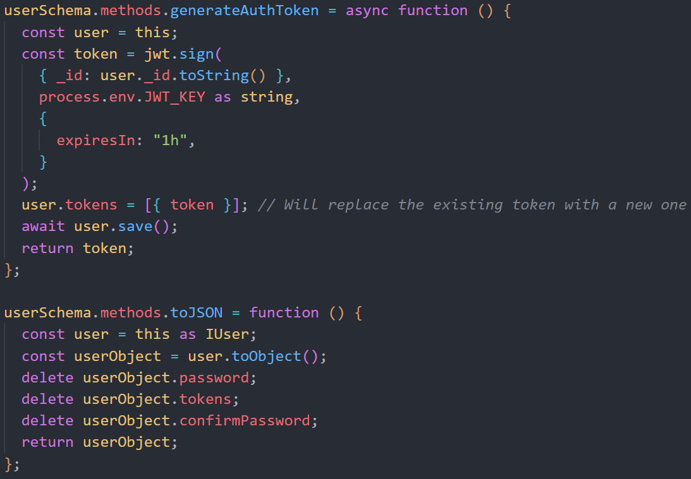

### Table of Contents

1. [DB setup](#db-setup)
2. [Middleware](#middleware)
3. [User](#user)
4. [Friend](#friend)

### DB setup

First we setup the MongoDB collection and connections. Then we moveon to VSC where we setup the .env setup the db.ts file.

**Mongo db:**
First we went ahead to [MongoDB Atlas](https://account.mongodb.com/account/register?fromURI=https%3A%2F%2Fwww.mongodb.com%2Fdeveloper%2Fauth%2Fsignin%2F%3FfromPagePath%3D%2Fproducts%2Fatlas%2F) and created an accout. Filled in the required fields and got to the dashboard.

Next we created a Cluster and gave it the name we whised to have **Sports**. Next we clicked on the connect button and choose **Compass** from the list. Installed Compass in our Device and copied the connection string.

Went to MongoDB Compass and pasted the connection string along side our Cluster password that was provided while creating the cluster. As Our IP adress was whitlisted we were able to connect. We whitelisted the IP adresses we wanted to have connection to the DB manually later on.

**.env and db**

1. The .env contains sensetive informations such as the MongoDB connection strings and the JWT secret key that was generated.


- We can generate the JWT secret key by runing the following code in the terminal:

```
node -e "console.log(require('crypto').randomBytes(64).toString('hex'))"
```

- The result will be something like this:


- The JWT is to be kept secrue and if compromised is to be changed.If changed all users verfied with old JWT will be logedout and would require to login again.

- A dotenv package was used to load the above variables into the process.env, as follows:

```
dotenv.config();
const port = process.env.PORT || 3000;
```

2. Database connection (`db.ts`):

In this file we iniciate the connection to MongoDB.

- We import dotenv from dotenv and then load the environment variables from the .env file by the follwing code in our db.ts file:

```
 dotenv.config();
```

- We make a function to establish the connection to the db:

```
const connectSportDB = async () => {
  try {
    const mongoURI: string = process.env.MONGODB_URL || "";
    await connect(mongoURI);
    console.log("MongoDB Connected...");
  } catch (err: any) {
    console.error(err.message);
    // Exit process with failure
    process.exit(1);
  }
};
```

- How the function works is that we first get the connection string from the .env by using the variable (process.env.MONGODB_URL). Next the connect function from mongoose module attempts to make a connection to database. When connection is successful, we get a message in the console. If not successful we get appropriate error message with faluire status.

- Finally, the export it as the default export of the module is used to export the function:

```
export default connectSportDB();
```

- That will allow us to import the module and the function that is connectSportDB will be called and connection established to DB.

### Middleware

In this middleware we use a rolebased authoraziton and user authentication.

- We export interface CustomRequest interface which extends the Request interface which is built-in Express interface. We add the user and token properties to let us access them from the request object.

```
export interface CustomRequest extends Request {
  user?: IUser;
  token?: string;
}
```

- The decoded token with the \_id field that is a string is from the user in the database that helps us so we can use it to find the user in the database.

```
interface DecodedToken {
  _id: string;
}
```

- Now we have the auth function where we export the auth function. It is an asynchronous function that takes req, res, and next as arguments.The req is the request object, res is the response object, and next is a callback function that calls the next middleware function. We use the cutomRequest interface from above to define the req object because we want to add the user and token properties to it. And in the res object we use the Response interface from express to define the res object. As for the next function assigned to the next parameter, it is an express function used for callback to call the next middleware function.



- In the auth function, we first try to get the token from the Authorization header of the request. If no token is found, an error is thrown. Then, we verify the token using the jwt.verify method. The decoded token is expected to have an \_id property, which is the ID of the user in the database. We then try to find the user in the database using the \_id from the decoded token and the token itself. If no user is found, an error is thrown. If the user is found and the token is valid, we attach the user and the token to the request object and call the next middleware function. If any error occurs during this process, we catch the error and send a response with a status of 401 and a message of "Authentication failed.


- The admin function is another middleware function that checks if the authenticated user is an admin. It first calls the auth function to authenticate the user. If the user is authenticated and their role is 0 (indicating an admin user), the next middleware function is called. If the user is not an admin, a response with a status of 403 and a message of "Access denied. User is not an admin." is sent.

### User

#### User Interface

The IUser interface extends the Document interface from Mongoose, which represents a MongoDB document and its properties. It defines the structure of a user document in the database.
  
``` export interface IUser extends Document
{
name: string;
userName: string;
email: string;
dateOfBirth: Date;
gender: string;
description?: object;
password: string;
confirmPassword?: string;
tokens: { token: string }[];
generateAuthToken: () => Promise<string>;
role: number;
}
```

- name, userName, email, dateOfBirth, gender, password, and role are required fields.
  description and confirmPassword are optional fields.
  tokens is an array of objects, each containing a token string.
  generateAuthToken is a method that returns a promise that resolves to a string. This method is used to generate an authentication token for the user.
  role is a number that represents the user's role in the application (e.g., admin, regular user).

- User Methods Interface
  The IUserMethods interface defines methods that a user document can use.

``` export interface IUserMethods {
generateAuthToken(): Promise<string>;
toJSON(): IUser; 
}
```

- generateAuthToken is a method that returns a promise that resolves to a string. This method is used to generate an authentication token for the user.
- toJSON is a method that returns an IUser object. This method is used to customize the JSON.stringify behavior.

- User Model Interface
- The UserModel interface extends the Model interface from Mongoose, which represents a MongoDB model and its properties. It defines methods that can be used on the User model.

```
export interface UserModel extends Model<IUser, IUserMethods> {
findByCredentials(
email: string,
password: string
): Promise<HydratedDocument<IUser, IUserMethods>>;
}
```

- findByCredentials is a method that takes an email and a password as arguments and returns a promise that resolves to a hydrated document of type IUser with IUserMethods. This method is used to find a user in the database by their email and password.

#### User Schema and Model

Our User Schema is used to defines the structure of the users documents in our MongoDB. and it includes the follwing:


And before saving a user document in our DB it is going to hashed using bcrypt that is imported from "bcryptjs".


Our schema has a method generateAuthToken to generate a JWT(token) for the user and save it in the tokens array. And a method toJSON to return a user object without the password, tokens, and confirmPassword fields.



Finally in our schema we have a static method findByCredentials to find a user by email and password.


#### User Model

The User Model is created by passing the User Schema to mongoose's model function. The model represents the users collection in the database and provides methods to query, update, delete, etc., documents in the collection.

#### User Controller

This TypeScript file usercontroller.ts is a part of a backend service, likely for a web application, and it defines various functions related to user management. These functions interact with a MongoDB database using Mongoose, and are designed to be used as middleware in Express.js routes. Here's a brief overview of each function:

registerUser: This function is used to register a new user. It validates the input, checks if the user already exists, and if not, creates a new user in the database.

loginUser: This function is used to log in a user. It checks if the user exists and if the password is correct, then returns the user and a generated authentication token.

logoutUser: This function is used to log out a user. It removes the token from the user's token list in the database.

getAllUsers: This function is used to get all users from the database.

getUser: This function is used to get a specific user by their ID.

searchUsers: This function is used to search for users by their username or email.

updateUser: This function is used to update a user's information.

deleteOwnAccount: This function is used to delete the currently authenticated user's account.

deleteUser: This function is used to delete a user by their ID.

getUserEvents: This function is used to get all events related to a specific user.

getFriends: This function is used to get all friends of the currently authenticated user.
Each function is designed to be used as a controller in an Express.js route, handling the request and response objects, interacting with the database, and sending the appropriate response.

#### User Routes

This TypeScript file users.ts is a part of an Express.js application and it defines various routes related to user management. These routes interact with the corresponding controllers imported from usercontroller.ts. Here's a brief overview of each route:

POST /register: This route is used to register a new user. It takes user data from the request body and passes it to the registerUser controller.

POST /login: This route is used to log in a user. It takes email and password from the request body and passes it to the loginUser controller.

POST /logout: This route is used to log out a user. It removes the token from the user's token list in the database.

POST /logoutall: This route is used to log out a user from all devices by clearing the user's token list in the database

GET /search: This route is used to search for users. It calls the searchUsers controller.

GET /:id/events: This route is used to get all events related to a specific user. It calls the getUserEvents controller.

GET /:id: This route is used to get a specific user by their ID. It calls the getUser controller.

GET /: This route is used to get all users. It calls the getAllUsers controller.

PUT /:id: This route is used to update a user's information. It takes user data from the request body and an ID from the route parameters, and passes them to the updateUser controller.

DELETE /me: This route is used to delete the currently authenticated user's account. It calls the deleteOwnAccount controller.

DELETE /:id: This route is used to delete a user by their ID. It calls the deleteUser controller.

GET /:id/friends: This route is used to get all friends of a specific user. It calls the getFriends controller.

Each route is protected by middleware functions auth and admin (for some routes) which check if the request is authenticated and if the authenticated user has admin privileges, respectively.
