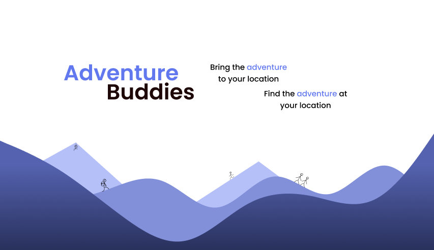
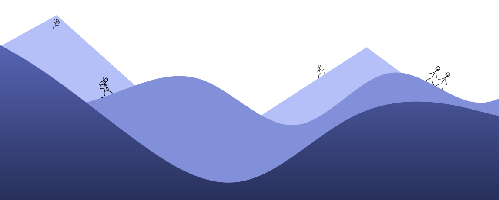

## Get the project running

- Begin with opening your local terminal and then place yourself in the right folder where you want to clone the project.
- Use command `git clone` followed by this link https://github.com/chas-academy/u08-business-idea-adventurebuddies.git
- Continue by navigating to the folder of the project and install all dependencies using command `npm install` or `yarn install`.
- Open the project in Visual Studio Code (e.g. with `code .` for Windows in the terminal).
- Run the project using the command `npm run dev` and navigate to your local server for this project http://localhost:5173/.

## Our Vision

The idea for this business came when one of our colleagues was eager to play Brännboll out on a field in Gärdet (Stockholm), and could not gather enough players. He cursed his bad luck - <i>"What's a man gotta do to play a little Brännboll around here?!"</i>, he thought to himself. In his hands he held a racket and a ball, thinking he was going to make a change.

<i>"EUREKA! I FOUND IT!"</i>

In all the morning haste, he showed up with the biggest enthusiasm in his eyes to our first daily standup meeting. <i>"Hey guys, you gotta listen to this. This is going to be huge!"</i>

Having all of our attention, he outbursts the sadness and joy he felt during that rainy day in Gärdet. The desperation and longing in his voice echoes in our office and he goes, determined: <i>"I believe in this". </i>

<b>Let us introduce you to: AdventureBuddies.</b>

A platform where we connect people with the same interests and ambitions. A place where we unite and create a happyplace for people with the same desires of the heart. A safespace where all of us can be, who we want to be. It is an adventure, where we connect.

The foundation of this application is an eventplanner. Where you can create your own events and have people from your area and city, to join you! Your daily life will never be the same, when you can join people on smaller activites or bigger events. Never another dull moment!

## Additional references for the project

- GoogleDrive folder containing planning: cost estimate sheet, preparation for personas, groupcontract and setup for backend, including links to: Figma, FigJam, Trelloboard, will be sent separately to examinator.

## Deployment

- https://adventurebuddies.netlify.app/

## The Work Team

- Denize Yildirim
- Emilia Hårdén
- Felicia Ahlström
- Felix Nagy
- Matilda Källström
- Mikael Jakobsson
- Sebah Abubekar

## Adventure Buddies License and Rights Statement

All content, including text, graphics, logos, and images, on the Adventure Buddies platform is the property of Adventure Buddies. Unauthorized use and/or duplication of this material without express and written permission from Adventure Buddies is strictly prohibited. All rights reserved for Adventure Buddies AB.

